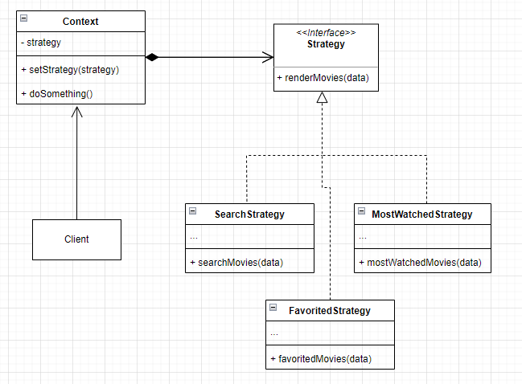
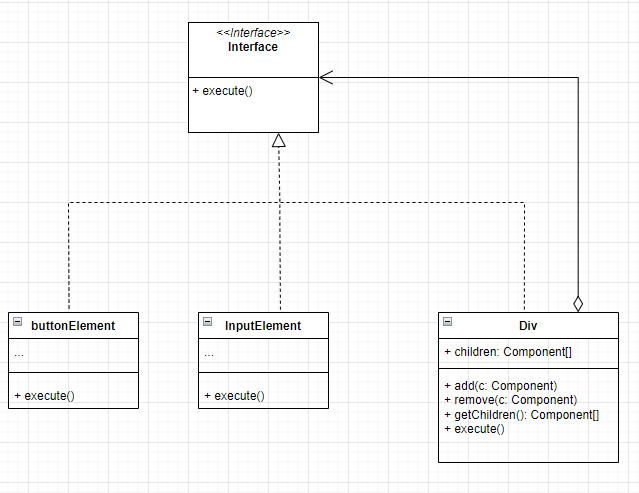
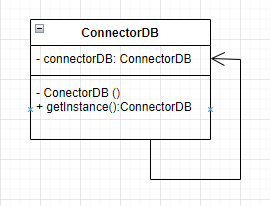

## Engenharia de Software III
### (Diagramas UML e Códigos Referentes aos Design Patterns aprendidos na Aula)

- ### Strategy

    <div>
     </img>
    </div>


    ```java
    // Interface para a Strategy
    interface Strategy {
    public List<Movie> filter(List<Movie> data);
    }

    // Strategy para Buscar Filmes
    class SearchStrategy implements Strategy {
    private String searchTerm;

    public SearchStrategy(String searchTerm) {
        this.searchTerm = searchTerm;
    }

    @Override
    public List<Movie> filter(List<Movie> data) {
        List<Movie> filteredMovies = new ArrayList<>();
        for (Movie movie : data) {
        if (movie.getTitle().contains(searchTerm) || movie.getDescription().contains(searchTerm)) {
                filteredMovies.add(movie);
            }
        }
            return filteredMovies;
        }
    }

    // Strategy para buscar os filmes mais assistidos
    class MostWatchedStrategy implements Strategy {

    @Override
    public List<Movie> filter(List<Movie> data) {
            // Implementação da Lógica para encontrar os filmes mais vistos
            // ...
            return null;
        }
    }

    
    class FavoritedStrategy implements Strategy {

    @Override
    public List<Movie> filter(List<Movie> data) {
            // Implementação da Lógica para buscar os filmes favoritos
            // ...
            return null;
        }
    }

    // Classe de contexto para a Strategy interface
    class MovieList {
        private Strategy strategy;

        public void setStrategy(Strategy strategy) {
            this.strategy = strategy;
        }

        public List<Movie> filterMovies(List<Movie> data) {
            return strategy.filter(data);
        }
    }

    // Client class
    public class MovieClient {

    public static void main(String[] args) {
        List<Movie> movies = new ArrayList<>();
    }

    MovieList movieList = new MovieList();

    movieList.setStrategy(new SearchStrategy("comedy")); {
        List<Movie> filteredMovies = movieList.filterMovies(movies);
    }

    
    movieList.setStrategy(new MostWatchedStrategy()); {
        filteredMovies = movieList.filterMovies(movies);
    }
    

    
    movieList.setStrategy(new FavoritedStrategy()); {
            filteredMovies = movieList.filterMovies(movies);
        }
    }

    class Movie {
        private String title;
        private String description;
    
    }

    ```

- ### Observer

    <div>
        </img>
    </div>

    ```java 
    public interface Subject {
        void subscribe(Subscriber subscriber);
        void unsubscribe(Subscriber subscriber);
        void notifySubscribers(String filename);
    }

    public class Publisher implements Subject {
        private final List<Subscriber> subscribers = new ArrayList<>();

        @Override
        public void subscribe(Subscriber subscriber) {
            subscribers.add(subscriber);
        }

        @Override
        public void unsubscribe(Subscriber subscriber) {
            subscribers.remove(subscriber);
        }

        @Override
        public void notifySubscribers(String filename) {
            for (Subscriber subscriber : subscribers) {
            subscriber.update(filename);
            }
        }

        public void doSomething() {
            String filename = "data.txt";
            notifySubscribers(filename);
        }
    }

    public interface Subscriber {
        void update(String filename);
    }

    public class EmailAlertListener implements Subscriber {

        @Override
        public void update(String filename) {
            System.out.println("EmailAlertListener: New file: " + filename);
        }
    }

    public class LoggingListener implements Subscriber {

    @Override
    public void update(String filename) {
            System.out.println("LoggingListener: New file: " + filename);
        }
    }

    public class ObserverDemo {

    public static void main(String[] args) {
            Publisher publisher = new Publisher();

            Subscriber emailAlertListener = new EmailAlertListener();
            publisher.subscribe(emailAlertListener);

            Subscriber loggingListener = new LoggingListener();
            publisher.subscribe(loggingListener);

            publisher.doSomething();
        }
    }

    ```

- ### Composite

    <div>
         </img>
    </div>


    ```java

    interface Component {
        void execute();
    }

    class ButtonElement implements Component {

        @Override
        public void execute() {
            System.out.println("ButtonElement: Execute");
        }
    }

    class InputElement implements Component {

        @Override
        public void execute() {
            System.out.println("InputElement: Execute");
        }
    }

    class Div implements Component {
        private List<Component> children = new ArrayList<>();

        public void add(Component component) {
            children.add(component);
        }

        public void remove(Component component) {
            children.remove(component);
        }

        public List<Component> getChildren() {
            return children;
        }

        @Override
        public void execute() {
            for (Component child : children) {
                child.execute();
            }
        }
    }

    public class CompositeDemo {

        public static void main(String[] args) {
            Div div = new Div();
            div.add(new ButtonElement());
            div.add(new InputElement());

            Div anotherDiv = new Div();
            anotherDiv.add(new InputElement());
            anotherDiv.add(new ButtonElement());
            div.add(anotherDiv);

            div.execute();
        }
    }


    ```

- ### Singleton

    <div>
         </img>
    </div>

    ```java
    public class ConnectorDB {
        private static ConnectorDB instance;
        private String connectionString;

        private ConnectorDB(String connectionString) {
            this.connectionString = connectionString;
            // Simula inicialização da conexão
            System.out.println("ConnectorDB: Initializing connection...");
        }

        public static ConnectorDB getInstance(String connectionString) {
            if (instance == null) {
                synchronized (ConnectorDB.class) {
                    if (instance == null) {
                        instance = new ConnectorDB(connectionString);
                    }
                }
            }
            return instance;
        }

    // Métodos específicos para interagir com o conector do banco de dados
        public void executeQuery(String query) {
            System.out.println("ConnectorDB: Executing query: " + query);
        }
    }

    ```

- ### Facade

    <div>
         </img>
    </div>

    ```java
    public interface PaymentFacade {
        boolean processPayment(int orderId, double amount, String paymentMethod);
    }

    public class PaymentProcessor {
    private final OrderService orderService;
    private final PaymentService paymentService;

    public PaymentProcessor(OrderService orderService, PaymentService paymentService) {
        this.orderService = orderService;
        this.paymentService = paymentService;
    }

    public boolean processPayment(int orderId, double amount, String paymentMethod){
            Order order = orderService.getOrder(orderId);
            if (order == null) {
                return false;
            }
            if (order.getAmountDue() != amount) {
                return false;
            }
            return paymentService.makePayment(amount, paymentMethod);
        }
    }

    public class OrderService {
    // Simula a lógica de pegar os detalhes da ordem
        public Order getOrder(int orderId) {
        // ...
            return new Order(orderId, 100.0, "pending");
        }
    }

    public class PaymentService {
    // Simula lógica de processar pagamento
        public boolean makePayment(double amount, String paymentMethod) {
        // ...
            return true;
        }
    }

    public class PaymentClient {

    public static void main(String[] args) {
            OrderService orderService = new OrderService();
            PaymentService paymentService = new PaymentService();
            PaymentFacade paymentFacade = new PaymentProcessor(orderService, paymentService);

            int orderId = 1;
            double amount = 100.0;
            String paymentMethod = "credit_card";

            boolean success = paymentFacade.processPayment(orderId, amount, paymentMethod);
            if (success) {
                System.out.println("Payment successful!");
            } else {
                System.out.println("Payment failed!");
            }
        }
    }

    class Order {
        private int id;
        private double amountDue;
        private String status;

        public Order(int id, double amountDue, String status) {
            this.id = id;
            this.amountDue = amountDue;
            this.status = status;
        }

        // Getters and setters
        //...
    }


    ```

