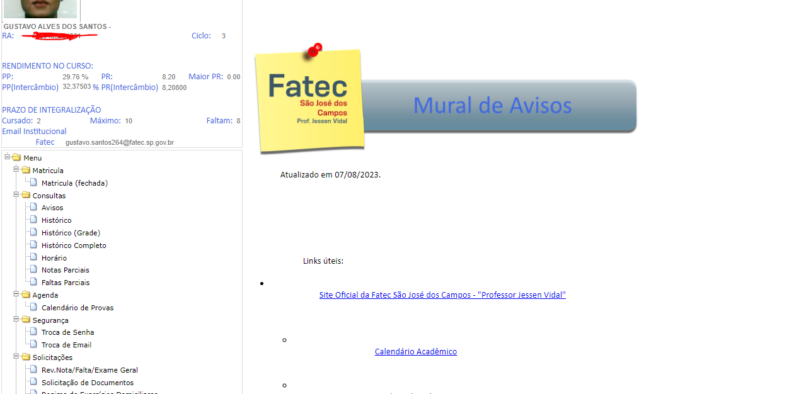

# Primeira Heurística - Visibilidade do Status do sistema

#### "O sistema deve sempre manter os usuários informados sobre o que está acontecendo, em tempo real, por meio de feedbacks instantâneos dentro de um prazo razoável, que servirão para orientar o usuário sobre o que está acontecendo na tela em que ele se encontra."

 

exemplo de erro:

  

A página home do siga é confusa e pouco intuitiva.

# Segunda Heurística - Correspondência entre o sistema e o mundo real

#### "O sistema deve ter a mesma linguagem que seu usuário utiliza no dia a dia, portanto utilizar palavras, frases, imagens e conceitos que sejam familiares ao usuário. Também é recomendável a utilização de ícones que representem uma ação para realizar essa correspondência."

 

exemplo de erro:

  

No menu lateral, há uma falta de símbolos para o facilitar a identificação do usuário.

# Terceira Heurística - Controle e liberdade para o usuário

#### "No sistema é importante que o usuário tenha liberdade para realizar ações que ele deseja, porém muitas vezes essas ações são realizadas por engano, nessas situações deve haver uma “saída de emergência” de fácil localização, permitindo que o usuário saia daquela janela indesejada ou retorne ao ponto anterior"

 

exemplo de erro:

  

Na plataforma SIGA, não existe nenhum botão para retornar a tela HOME. O mais próximo disso, que seria o botão Menu, apenas colapsa as opções para visitar outras partes do site.

# Quarta Heurística - Consistência e padronização

#### "Não devemos deixar o usuário em dúvida se palavras, situações ou ações diferentes tem o mesmo significado, para isso a interface deve manter uma consistência, permitindo que o usuário identifique os padrões de estética, interação e informação existentes nesta."

 

exemplo de acerto:

  

Interfaces com padrões visuais em diferentes ferramentas

# Quinta Heurística - Prevenção de erros

#### "Essa heurística foca em criar uma plataforma que busca prevenir que problemas ocorram, eliminando condições mais propensas ao erro, isso pode ser feito sinalizando ações como quando o usuário não finalizou uma tarefa e pede para sair da página ou oferecendo a ele uma opção de confirmação antes de completar uma ação."

 

exemplo de acerto:

  

Exemplo de como o Windows pergunta para o usuário se ele tem certeza de que quer apagar um certo arquivo.

# Sexta Heurística - Reconhecimento em vez de recordação

#### "Devemos minimizar a quantidade de informações que o usuário precisa memorizar, para isso, objetos, ações e opções importantes devem ficar visíveis, isso faz com que o cérebro perceba as ações que são similares, reconhecendo assim padrões."

 

exemplo de acerto:

  

É muito fácil reconhecer as ações num site de vendas, saber onde procurar por produtos, carrinho, etc.

# Sétima Heurística - Flexibilidade e eficiência de uso

#### "É importante deixar uma experiência boa com seu sistema desde o usuário mais leigo até o mais avançado."

 

exemplo de erro:

  

O Siga não exibe a grade de horário de forma clara ao aluno. Além de as matérias estarem em formato abreviado, a ordem em que aparecem não é definida pelo horário da aula e sim por ordem alfabética.

### Possível solução

<ul>
  <li>Usar uma abreviação mais clara ao nome da matéria. Ex: 'sociedade e tecnologia' - STEC, SOC.</li>
  <li>Ordenar as matérias por horário da aula.</li>
</ul>

# Oitava Heurística - Estética e design minimalista

#### "Quanto maior a quantidade de informações, mais tempo o usuário vai levar para analisá-las e poder tomar uma decisão, aumentando assim as chances dele abandonar a aplicação/site por achar confuso demais.
#### Portanto o design da interface deve ser minimalista e o conteúdo o mais direto possível, informações que forem secundárias podem ser deixadas em segundo plano, como menus e abas."

 

exemplo de erro:

  

A plataforma SIGA tem um design minimalista demais, com muitas informações úteis não sendo exibidas na tela principal (que deveria exibir informações importantes, afinal ela se chama Avisos), com essas informações sendo enviadas para o email institucional dos alunos..
