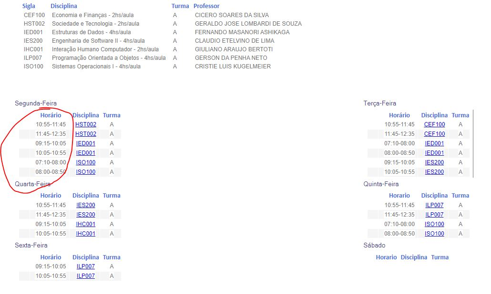

# Primeira Heurística - Visibilidade do Status do sistema

#### "O sistema deve sempre manter os usuários informados sobre o que está acontecendo, em tempo real, por meio de feedbacks instantâneos dentro de um prazo razoável, que servirão para orientar o usuário sobre o que está acontecendo na tela em que ele se encontra."

 

  

A página home do siga é confusa e pouco intuitiva.

# Sétima Heurística - Flexibilidade e eficiência de uso

#### "É importante deixar uma experiência boa com seu sistema desde o usuário mais leigo até o mais avançado."

 

  

O Siga não exibe a grade de horário de forma clara ao aluno. Além de as matérias estarem em formato abreviado, a ordem em que aparecem não é definida pelo horário da aula e sim por ordem alfabética.

### Possível solução

<ul>
  <li>Usar uma abreviação mais clara ao nome da matéria. Ex: 'sociedade e tecnologia' - STEC, SOC.</li>
  <li>Ordenar as matérias por horário da aula.</li>
</ul>

